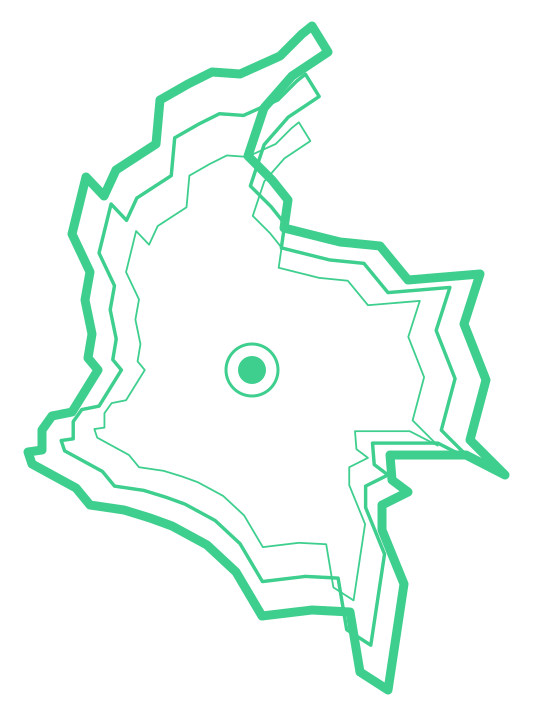
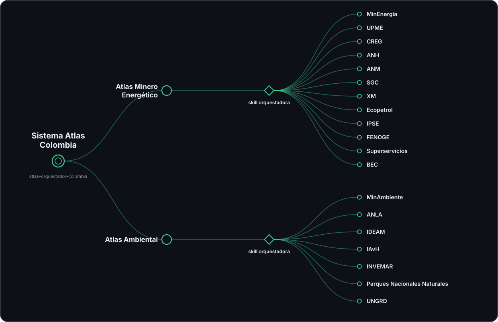

<div align="center">
  
  <h1>Sistema Atlas Colombia</h1>
  <p><em>Marco común y registro abierto de atlas sectoriales: el sistema que conecta las rutas hacia la información pública de Colombia.</em></p>
  <table>
    <tr>
      <td align="center" width="180">
        <a href="https://github.com/Nicolas9714/atlas-minero-energetico-colombia">
          <br>
          <strong>Atlas de Navegación<br>Minero Energético<br>de Colombia</strong>
        </a>
      </td>
      <td align="center" width="180">
        <a href="https://github.com/Nicolas9714/atlas-ambiental-colombia">
          <br>
          <strong>Atlas de Navegación<br>Ambiental<br>de Colombia</strong>
        </a>
      </td>
    </tr>
  </table>
</div>

---

Sistema Atlas Colombia es un proyecto abierto que busca democratizar el acceso a la información pública de Colombia. Parte de una convicción: hacer pública la información también implica hacer públicas sus rutas y conexiones. La información ya está publicada en portales, sistemas de información y geovisores — lo que falta es saber llegar a ella —, y este proyecto convierte esas rutas en una estructura abierta, documentada y operable por herramientas de IA: agentes de código, IA agéntica y LLMs. El Sistema representa el nodo que articula y coordina los Atlas de Navegación sectoriales de Colombia: define el estándar que comparten, registra qué atlas existen y qué entidades cubre cada uno, y orquesta las consultas que cruzan de un sector a otro.

Saber navegar la información pública de Colombia — dónde buscar, qué priorizar, qué ignorar, qué fuente contrastar — es un conocimiento práctico que suele permanecer invisible, acumulado en la experiencia de quienes conocen cada sector. Cada Atlas de Navegación convierte ese saber en una estructura abierta, documentada y reutilizable que opera directamente en herramientas de IA.

## Cómo funciona

Cada Atlas de Navegación es una colección abierta de skills — archivos Markdown instalables en agentes y herramientas de IA para código (Claude Code, Codex, entre otras) — que documentan cómo encontrar, usar y apropiar la información pública de un sector. Una skill por entidad, más una skill orquestadora que coordina las consultas que cruzan entidades del sector. 

Este repositorio agrega la capa siguiente: la skill que coordina las consultas que cruzan atlas. Cómo se construye cada skill está definido en la [especificación](estandar/especificacion.md).

El mismo patrón se repite en tres escalas: una unidad funciona sola, y una orquestadora opcional conecta varias.

| Escala | Unidad | Orquestadora | Qué resuelve |
| --- | --- | --- | --- |
| Entidad | Skill `navegar-*` (3 archivos: orientación, mapa web, fuentes) | — | «¿Dónde consulto los expedientes de la ANLA?» |
| Atlas | Colección de skills de un sector | `atlas-orquestador-<sector>` del atlas | «¿Qué entidad del sector ambiental tiene los datos de calidad del agua?» |
| Sistema | Los atlas registrados | `atlas-orquestador-colombia` (este repo) | «¿Qué títulos mineros hay en la zona y qué restricciones ambientales la limitan?» |

Cada nivel enruta hacia abajo sin reemplazar lo de abajo: la respuesta específica siempre vive en la skill de la entidad. Si solo tienes un atlas instalado, todo sigue funcionando — el atlas resuelve su sector y te señala dónde vive el resto.

Tres piezas de este repositorio sostienen el Sistema: el estándar define la forma común que hace interoperables los atlas, el registro sistematiza qué atlas existen y dónde termina la competencia de cada sector, y la skill orquestadora nacional pone esa estructura a operar enrutando cada tramo de una consulta al atlas que puede responderlo.

## Atlas registrados

| Atlas | Sector | Entidades | Repositorio |
| --- | --- | --- | --- |
| Atlas de Navegación Minero Energético de Colombia | Minero energético | 12 | [atlas-minero-energetico-colombia](https://github.com/Nicolas9714/atlas-minero-energetico-colombia) |
| Atlas de Navegación Ambiental de Colombia | Ambiental | 7 | [atlas-ambiental-colombia](https://github.com/Nicolas9714/atlas-ambiental-colombia) |



El detalle de entidades y fronteras temáticas vive en [`registro.md`](registro.md).

## Qué contiene este repositorio

```text
sistema-atlas-colombia/
├── registro.md       → Atlas existentes, entidades de cada uno, fronteras temáticas
├── skills/
│   └── atlas-orquestador-colombia/  → Skill que enruta consultas entre atlas
├── estandar/
│   ├── especificacion.md            → El estándar de los atlas (versionado)
│   └── templates/                   → Plantillas para construir nuevas skills
└── examples/
    └── consultas-de-ejemplo.md      → Consultas que cruzan atlas, con su ruta esperada
```

## Cómo usar la skill orquestadora nacional

`atlas-orquestador-colombia` solo es útil si tienes instalados dos o más atlas. Cada atlas funciona completo por sí solo; esta skill agrega el enrutamiento entre ellos.

### Instalación con script

Con los repos clonados junto a tu proyecto, un solo comando ejecutado desde la raíz del proyecto instala los atlas que pidas — y, si son dos o más, agrega automáticamente la orquestadora nacional:

> El repo clonado y la copia en tu proyecto cumplen roles distintos: el clon es la fuente, que actualizas con `git pull`; la copia en tu carpeta de skills es la instalación, que tu proyecto controla y que solo cambia cuando decides reinstalar. Un mismo clon puede alimentar varios proyectos.

```powershell
# Windows (PowerShell)
..\sistema-atlas-colombia\instalar.ps1 -Atlas todos
```

```bash
# macOS / Linux / Git Bash
../sistema-atlas-colombia/instalar.sh --atlas todos
```

Opciones: `-Atlas ambiental,minero-energetico` elige atlas específicos; `-Destino .agents\skills` instala para Codex; `-Entidad navegar-anla` instala una sola skill; `-Global` instala en tu carpeta de usuario; `-Actualizar` hace `git pull` en los repos fuente antes de copiar. En bash las opciones son las mismas en minúscula (`--atlas`, `--destino`, `--entidad`, `--global`, `--actualizar`).

Los pasos siguientes muestran la instalación manual equivalente.

### 1. Instala los atlas

Sigue el README de cada atlas ([Atlas de Navegación Minero Energético de Colombia](https://github.com/Nicolas9714/atlas-minero-energetico-colombia), [Atlas de Navegación Ambiental de Colombia](https://github.com/Nicolas9714/atlas-ambiental-colombia)): clonar el repo junto a tu proyecto y copiar sus skills a la carpeta de skills de tu herramienta.

### 2. Agrega la orquestadora nacional

Clona este repositorio junto a los atlas y copia la skill:

```bash
git clone https://github.com/Nicolas9714/sistema-atlas-colombia.git
cp -r ../sistema-atlas-colombia/skills/atlas-orquestador-colombia .claude/skills/
```

En Windows, usa PowerShell:

```powershell
Copy-Item -Recurse -Force `
  "..\sistema-atlas-colombia\skills\atlas-orquestador-colombia" `
  ".claude\skills\"
```

Cambia `.claude\skills` por `.agents\skills` si estás usando Codex. En Claude.ai, ChatGPT, Gemini u otras plataformas, adjunta el `SKILL.md` de la skill o agrégalo al proyecto junto con los archivos de los atlas.

### 3. Pregunta en lenguaje natural

Cuando la consulta cruce sectores, la skill identifica qué parte responde cada atlas y en qué orden:

> - «¿Qué títulos y solicitudes mineras existen en el suroeste de Antioquia, qué potencial geológico tiene la zona y qué restricciones ambientales la limitan?»
> - «¿Qué proyectos de hidrocarburos con licencia activa operan en el Magdalena Medio, qué obligaciones ambientales tienen y qué muestra el monitoreo de sus cuencas?»
> - «¿Cuánta capacidad solar y eólica entró en operación frente a la meta 6GW, qué proyectos siguen en licenciamiento y cuánto generan los que ya operan?»

Las rutas esperadas de estas consultas viven en [`examples/consultas-de-ejemplo.md`](examples/consultas-de-ejemplo.md).

## Para quién

- investigadores y estudiantes que cruzan sectores en un mismo análisis
- analistas y consultores de proyectos con componentes técnicos y ambientales
- funcionarios públicos que coordinan entre entidades
- equipos y personas que quieran construir un atlas nuevo sobre el estándar

## Cómo crear un atlas nuevo

1. Lee [`estandar/especificacion.md`](estandar/especificacion.md) — distingue lo obligatorio (N1–N5) de lo recomendado. Un atlas es compatible cumpliendo solo lo obligatorio.
2. Usa las plantillas de [`estandar/templates/`](estandar/templates/) para las skills de entidad, y los dos atlas registrados como referencia de buenas prácticas.
3. Cuando el atlas esté publicado, propón su registro con un pull request a [`registro.md`](registro.md), declarando la versión del estándar que cumple y agregando su tarjeta al banner de este README.

La información pública se organiza según las competencias de las instituciones que la producen, y los problemas reales suelen abarcar varias: por eso cada atlas nuevo amplía lo que el Sistema puede responder. El estándar aplica a cualquier sector — agro, salud, transporte — y a cualquier país: un nodo nacional de otro país usa esta misma forma sin pedir permiso ni coordinación central, y los sistemas nacionales que comparten el estándar forman, entre sí, una red.

## Contribuir

Ver [CONTRIBUTING.md](CONTRIBUTING.md): cómo registrar un atlas, proponer cambios al estándar o mejorar el enrutamiento entre atlas.

## Licencia

Ver [LICENSE](LICENSE).
